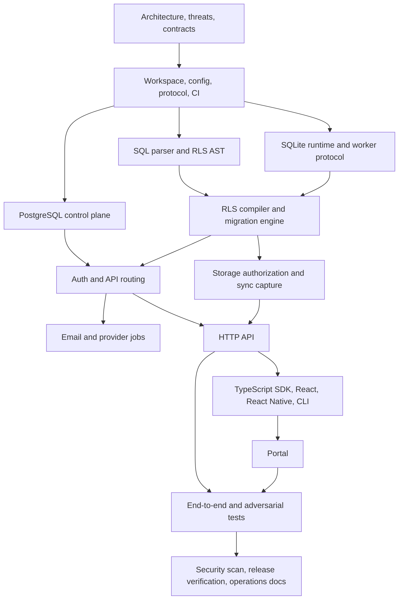

# Dependency Graph and Milestones

## Dependency-ordered milestones

1. **Foundation:** reproducible workspaces, config validation, IDs/errors/protocol,
   Docker Compose, PostgreSQL schema, worker IPC, CI.
2. **Secure SQL:** SQLite sessions, authorizer, limits, custom RLS parser/compiler,
   migrations, query/transaction/schema/policy APIs, bypass tests.
3. **Identity and platform:** organizations/projects/API keys, registration,
   verification, sessions, JWT/refresh rotation, Resend queue and templates.
4. **Data services:** S3 metadata/authorization, logical capture, snapshot,
   pull/push, LWW, tombstones, cursor invalidation.
5. **Developer experience:** browser/Node/RN SDKs, React integrations, CLI, portal.
6. **Operations and release:** backups/restores, metrics/traces/audit/quotas,
   load/crash/fuzz tests, ARM64 CI, security scan, complete documentation.

No milestone may replace a required security mechanism with a mock. Provider test
doubles are allowed only behind the same interface and contract tests.

