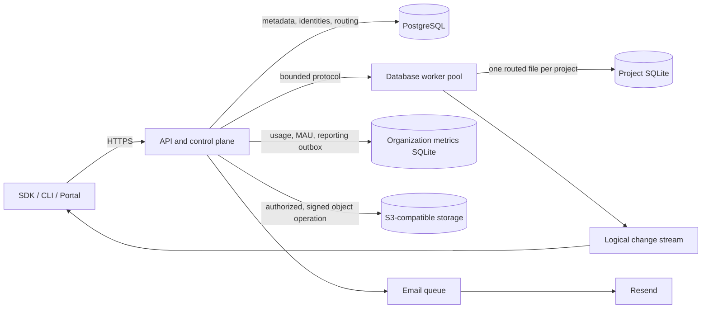

# FFDB Architecture

Status: accepted implementation baseline (decision record `ADR-0001`).

FFDB is a self-hostable data platform whose security boundary is the hosted Rust
service plus isolated database workers. PostgreSQL stores control-plane state;
each project has exactly one routed SQLite application database. SQLite files,
worker sockets, physical table names, and provider credentials are never exposed
to callers.

## Runtime topology

The API authenticates developer keys or project JWTs, resolves opaque project
identifiers through PostgreSQL, applies rate/concurrency limits, and schedules a
bounded request to a worker. Workers own SQLite connections, install immutable
request context and authorizer callbacks, enforce engine limits, execute work,
capture changes, and clear or discard connections before reuse.

## Trust and execution modes

- **Developer mode** uses hashed, scoped API keys. It permits approved DDL,
  migrations, schema/policy introspection, administrative DML, and configuration.
  It does not permit host paths, dynamic extensions, writable schema, unsafe
  virtual tables, arbitrary `ATTACH`, or `VACUUM INTO`.
- **End-user mode** accepts only verified project JWTs. Parser classification and
  the SQLite authorizer independently restrict execution to parameterized
  `SELECT`, `INSERT`, `UPDATE`, and `DELETE`. Routing happens only after signature,
  issuer, audience, key id, time, and project claims are verified.
- **Internal mode** is crate-private and available only to audited worker code.
  Public APIs cannot return a raw connection.

## Project database model

Enabling RLS transforms a logical table into a protected physical table in the
reserved `__ffdb_` namespace plus a developer-facing view. Generated
`INSTEAD OF` triggers enforce write predicates; the view enforces read predicates.
Policy metadata, sync rows, and schema state are protected internal objects.
The authorizer permits internal access only when it originates from an approved
generated view/trigger and denies caller-authored objects that impersonate the
reserved namespace.

Trusted scalar functions (`auth.uid()`, `auth.role()`, `auth.jwt()`, and
`auth.claim(name)`) are compiled to namespaced SQLite functions backed by an
immutable Rust `AuthContext`. Callers cannot register functions or mutate that
context. Every request pins one connection for its complete transaction.

## RLS semantics

The custom parser accepts the documented PostgreSQL-style policy statements and
stores a normalized internal AST. For each command and applicable role:

- permissive predicates combine with OR;
- restrictive predicates combine with AND;
- the final predicate is `(any permissive) AND (all restrictive)`;
- no applicable permissive policy is default deny;
- `USING` governs visible/existing rows; `WITH CHECK` governs new rows;
- `FOR ALL` contributes to each operation;
- disabled RLS bypasses policies only for verified developer administrative mode;
- forced RLS also applies to developer administrative DML.

FFDB documents SQLite-specific differences and never claims byte-for-byte
PostgreSQL compatibility.

## Data and control planes

PostgreSQL owns organizations, memberships, projects, database routes, API keys,
JWT key metadata, auth identities, refresh-token families, template metadata,
migration history, rate limits, audit events, backups, worker leases, and
lifecycle state. Deployment-scoped provider credentials come from validated
runtime configuration and a production secret manager. PostgreSQL never stores
caller-supplied filesystem paths. Project SQLite owns application rows, RLS
metadata, object metadata and usage, and the durable logical change log.
Separate organization-scoped SQLite ledgers own idempotent
read/write/storage/MAU accounting plus provider-reporting and reconciliation
state beneath the trusted `FFDB_METRICS_ROOT`.

## Sync and storage

Every committed mutation appends a logical change in the same SQLite transaction.
Opaque authenticated cursors carry project, sequence, schema version, scope
fingerprint, and expiry. Pull re-evaluates SELECT RLS. A policy/scope/schema change
that cannot revoke cached rows safely yields a resnapshot control event. Push is
idempotent by client mutation id and uses server commit sequence as the sole LWW
ordering authority. Tombstones survive a configurable retention window.

Storage bytes live in S3. Buckets, objects, uploads, owners, checksums, quotas, and
versions live in RLS-protected SQLite tables. A signed URL is issued only after an
authorized metadata operation, is short lived, is scoped to one method/key, and is
audited. There is no parallel storage authorization model.

## Reliability model

- bounded queues, worker processes, per-project concurrency, SQLite progress
  cancellation, statement/transaction deadlines, row/byte/variable/SQL limits;
- structured tracing with an explicit subscriber extension seam, request IDs,
  Prometheus metrics, health endpoints, audit events, graceful shutdown, and
  redacted secrets;
- project lifecycle locks serialize migration, restore, backup, and compaction;
- SQLite online backups and integrity checks are recorded in PostgreSQL and tested
  by restore drills;
- organization metrics ledgers are backed up at a recovery point coordinated
  with PostgreSQL billing state;
- all caches are bounded, keyed by immutable identifiers and versions, and
  invalidated by lifecycle/schema/key changes.

## Repository boundaries

Rust crates expose narrow interfaces; applications perform composition only.
TypeScript packages depend only on the versioned JSON protocol. The portal uses
the same public SDK and developer APIs as the CLI. Provider adapters are traits
with local implementations for Docker Compose and production implementations
configured from validated, encrypted settings.
